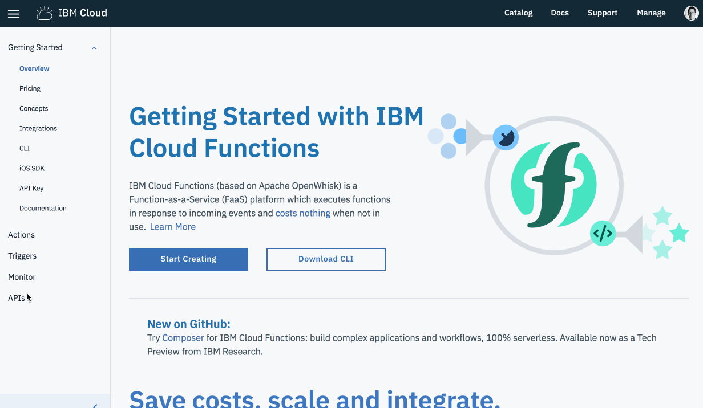
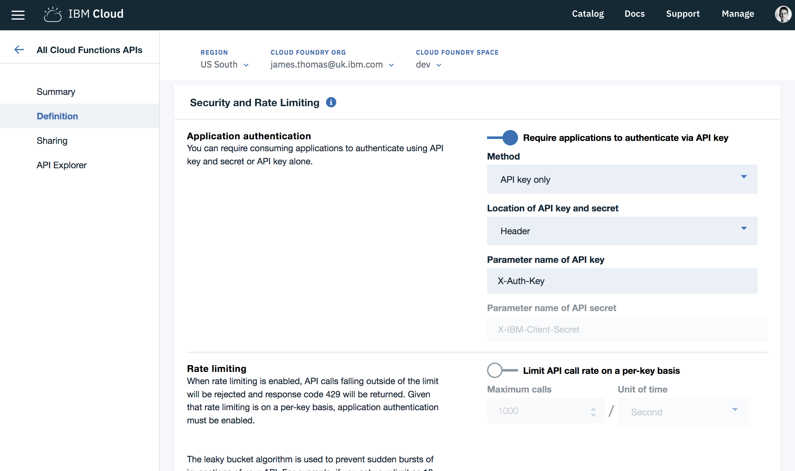
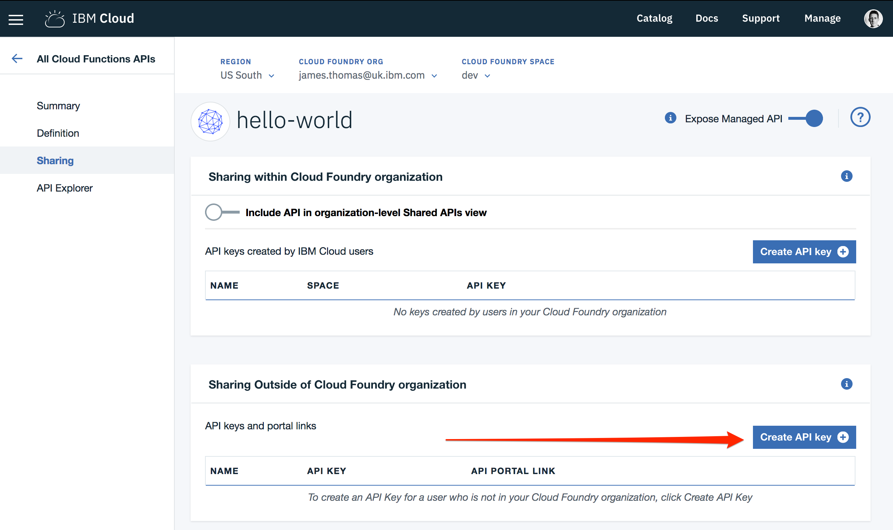
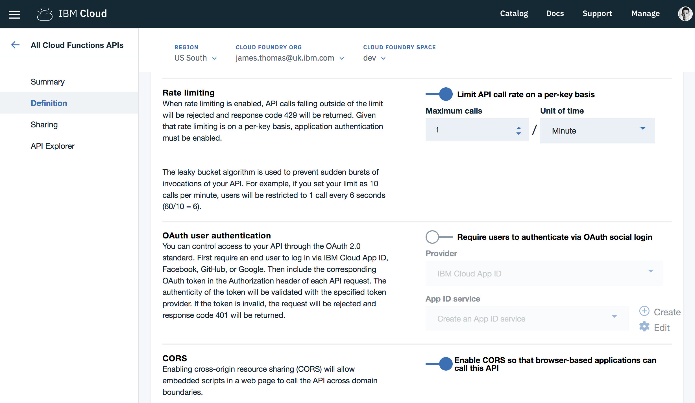

# exposing APIs from actions

This exercise shows you how to create public HTTP endpoints from actions. You will learn how to create web actions and use the integrated API gateway.

*Once you have completed this exercise, you will have…*

- **Understood how IBM Cloud Functions can expose HTTP endpoints.**
- **Created numerous example Web Actions**
- **Enabled API Gateway integration including authentication and rate-limiting.**

Once this exercise is finished, you will be able to creating scalable HTTP APIs using IBM Cloud Functions!

## Table Of Contents

* [Background](#background)
  * [Web Actions](#web-actions)
  * [API Gateway](#api-gateway)
* [Web Actions](#web-actions)
  * [Content Extensions](#content-extensions)
  * [HTTP Request Properties](#http-request-properties)
  * [Controlling HTTP Responses](#controlling-http-responses)
  * [Additional Features](#additional-features)
  * [Example - HTTP Redirect](#example-—http-redirect)
  * [Example - JPEG Response](#example-—jpeg-response)
  * [Example - Manual JSON Response](#example—-manual-json-response)
* [API Gateway](#api-gateway)
  * [Example](#example)
  * [Saving & Restoring](#saving-&-#restoring)
* [API Management Features](#api-management-features)
  * [Authentication](#authentication)
  * [Rate Limiting](#rate-limiting)
* [EXERCISES](#exercises)

## Instructions

### Background

Serverless applications are a great solution for building public API endpoints. Developers are now building "serverless web applications" by hosting their static files on a CDN and then using serverless platforms for their APIs.

OpenWhisk has a comprehensive RESTful API for the platform that allows you to invoke actions using authenticated HTTP requests. However, if you want to build APIs for public web sites or mobile applications, the authentication credentials will need embedding in client-side files. This is a terrible idea for obvious reasons…. but don't panic!

OpenWhisk has a solution for creating public APIs to invoke your actions without exposing credentials. 😎

Let's review some concepts which explain how this feature works in Apache OpenWhisk.

#### Web Actions

OpenWhisk actions can be annotated with a special flag at runtime to convert them into "web actions". Web actions can then be invoked through the public platform API using a HTTP request without user authentication. HTTP request parameters are automatically converted in event parameters. Values returned from the action are automatically serialised to a JSON response.

Web actions are a simple way to expose public HTTP endpoints from OpenWhisk actions. If you want to implement user authentication, rate limiting or routing, web actions have to manually handle this in the OpenWhisk action code. If you are building high-traffic and enterprise APIs, you will want a better solution to implementing these API features, that doesn't require lots of boilerplate code…

#### API Gateway

OpenWhisk comes with an integrated API Gateway. This allows the developers to create new HTTP APIs which map incoming requests to web actions. The API Gateway handles capabilities like routing based on request properties (URI paths and HTTP method), user authentication, rate limiting and more. Developers do not need to implement this features within the web action code.

Using the API Gateway is an extension to web actions that allows you to build enterprise high-traffic HTTP APIs with minimal effort using IBM Cloud Functions.

### Web Actions

Let's turn the `hello` action into a web action. Once it has been converted, we can call this action using a normal HTTP request.

1. Update the action to set the `—web` flag to `true`.

```
$ ic wsk action update hello --web true
ok: updated action hello
```

2. Retrieve the web action URL exposed by the platform for this action.

```
$ ic wsk action get hello --url
ok: got action hello
https://openwhisk.ng.bluemix.net/api/v1/web/user%40host.com_dev/default/hello
```

3. Invoke the web action URL with the JSON extension, passing in query parameters for `name` and `place`.

```
$ curl "https://openwhisk.ng.bluemix.net/api/v1/web/user%40host.com_dev/default/hello.json?name=Bernie"
{
  "message": "Hello Bernie from Vermont!"
}
```

4. Disable web action support.

```
$ ic wsk action update hello --web false
ok: updated action hello
```

5. Verify the action is not externally accessible with authentication.

```
$ curl "https://openwhisk.ng.bluemix.net/api/v1/web/user%40host.com_dev/default/hello.json?name=Bernie"
{
  "error": "The requested resource does not exist.",
  "code": 4452991
}
```

#### Content Extensions

Web actions invoked through the platform API need a content extension to tell the platform how to interpret the content returned from the action. In the example above, we were using the `.json` extension. This tells the platform to serialise the return value out to a JSON response.

The platform supports the following content-types: `.json`, `.html`, `.http`, `.svg` or `.text`. If no content extension is provided, it defaults to `.http` which gives the action full control of the HTTP response.

#### HTTP Request Properties

All web actions, when invoked, receives additional HTTP request details as parameters to the action input argument. These include:

1. `__ow_method` (type: string). the HTTP method of the request.
2. `__ow_headers` (type: map string to string): A the request headers.
3. `__ow_path` (type: string): the unmatched path of the request (matching stops after consuming the action extension).
4. `__ow_user` (type: string): the namespace identifying the OpenWhisk authenticated subject
5. `__ow_body` (type: string): the request body entity, as a base64 encoded string when content is binary or JSON object/array, or plain string otherwise
6. `__ow_query` (type: string): the query parameters from the request as an unparsed string

The `__ow_user` is only present when the web action is [annotated to require authentication](https://github.com/apache/incubator-openwhisk/blob/master/docs/annotations.md#annotations-specific-to-web-actions) and allows a web action to implement its own authorization policy. The `__ow_query` is available only when a web action elects to handle the ["raw" HTTP request](https://github.com/apache/incubator-openwhisk/blob/master/docs/webactions.md#raw-http-handling). It is a string containing the query parameters parsed from the URI (separated by `&`). The `__ow_body` property is present either when handling "raw" HTTP requests, or when the HTTP request entity is not a JSON object or form data. Web actions otherwise receive query and body parameters as first class properties in the action arguments with body parameters taking precedence over query parameters, which in turn take precedence over action and package parameters.

#### Controlling HTTP Responses

Web actions can return a JSON object with the following properties to directly control the HTTP response returned to the client.

1. `headers`: a JSON object where the keys are header-names and the values are string, number, or boolean values for those headers (default is no headers). To send multiple values for a single header, the header's value should be a JSON array of values.
2. `statusCode`: a valid HTTP status code (default is 200 OK if body is not empty otherwise 204 No Content).
3. `body`: a string which is either plain text, JSON object or array, or a base64 encoded string for binary data (default is empty response).

The `body` is considered empty if it is `null`, the empty string `""` or undefined.

If a `content-type header` is not declared in the action result’s `headers`, the body is interpreted as `application/json` for non-string values, and `text/html` otherwise. When the `content-type` is defined, the controller will determine if the response is binary data or plain text and decode the string using a base64 decoder as needed. Should the body fail to decoded correctly, an error is returned to the caller.

#### Additional Features

Web actions have a [lot more features](https://github.com/apache/incubator-openwhisk/blob/master/docs/webactions.md), see the documentation for full details on all these capabilities.

#### Example - HTTP Redirect

1. Create a new web action from the following source code.

##### Node.js example

```javascript
function main() {
    return {
        headers: { location: "http://openwhisk.org" },
        statusCode: 302
  };
}
```

```
$ ic wsk action create redirect action.js --web true
ok: created action redirect
```

##### Swift example

```swift
func main(args: [String:Any]) -> [String:Any] {
    return [
        "headers": ["location": "http://openwhisk.org"],
        "statusCode": 302
    ]
}
```

```
$ ic wsk action create redirect action.swift --web true
ok: created action redirect
```

2. Retrieve URL for new web action

```
$ ic wsk action get redirect --url
ok: got action redirect
https://openwhisk.ng.bluemix.net/api/v1/web/user%40host.com_dev/default/redirect
```

3. Check HTTP response is HTTP redirect.

```
$ curl -v https://openwhisk.ng.bluemix.net/api/v1/web/user%40host.com_dev/default/redirect
< HTTP/1.1 302 Found
< X-Backside-Transport: OK OK
< Connection: Keep-Alive
< Transfer-Encoding: chunked
< Server: nginx/1.11.13
< Date: Fri, 23 Feb 2018 11:23:24 GMT
< Access-Control-Allow-Origin: *
< Access-Control-Allow-Methods: OPTIONS, GET, DELETE, POST, PUT, HEAD, PATCH
< Access-Control-Allow-Headers: Authorization, Content-Type
< location: http://openwhisk.org 
```

#### Example - HTML Response

1. Create a new web action from the following source code.

##### Node.js example

```javascript
function main() {
    let html = "<html><body>Hello World!</body></html>"
    return { headers: { "Content-Type": "text/html" },
             statusCode: 200,
             body: html };
}
```

```
$ ic wsk action create html action.js --web true
ok: created action html
```

##### Swift example

```swift
func main(args: [String:Any]) -> [String:Any] {
    let html = "<html><body>Hello World!</body></html>"
    return [
        "headers": ["Content-Type": "text/html"],
        "statusCode": 200,
        "body": html
    ]
}
```

```
$ ic wsk action create html action.swift --web true
ok: created action html
```

1. Retrieve URL for new web action

```swift
$ ic wsk action get html --url
ok: got action html
https://openwhisk.ng.bluemix.net/api/v1/web/user%40host.com_dev/default/html
```

3. Check HTTP response is HTML.

```
$ curl https://openwhisk.ng.bluemix.net/api/v1/web/user%40host.com_dev/default/html
<html><body>Hello World!</body></html>
```

#### Example - JPEG Response

1. Download PNG image and generate base64 string.

```
$ wget https://static01.nytimes.com/newsgraphics/2015/01/30/candidate-tracker/assets/images/sanders-square-silo-150.png
$ base64 sanders-square-silo-150.png
```

2. Create a new web action from the following source code.

##### Node.js

```javascript
function main() {
    let png = "<BASE64 ENCODED IMAGE STRING>"
    return { headers: { "Content-Type": "image/png" },
             statusCode: 200,
             body: png };
}
```

```
$ ic wsk action create image action.js --web true
ok: created action image
```

##### Swift

```swift
func main(args: [String:Any]) -> [String:Any] {
    let png = "<BASE64 ENCODED IMAGE STRING>"

    return [
        "headers": ["Content-Type": "image/png"],
        "statusCode": 200,
        "body": png
    ]
}
```

```
$ ic wsk action create image action.swift --web true
ok: created action image
```

3. Retrieve URL for new web action.

```
$ ic wsk action get image --url
ok: got action image
https://openwhisk.ng.bluemix.net/api/v1/web/user%40host.com_dev/default/image
```

4. Open URL in web browser to check the following image is returned.


#### Example - Manual JSON response

1. Create a new web action from the following source code.

##### Node.js

```javascript
function main(params) { 
    return {
        statusCode: 200,
        headers: { 'Content-Type': 'application/json' },
        body: params
    };
}
```

```
$ ic wsk action create manual action.js --web true
ok: created action manual
```

##### Swift

```javascript
func main(args: [String:Any]) -> [String:Any] {
    return [
        "headers": ["Content-Type": "application/json"],
        "statusCode": 200,
        "body": args
    ]
}
```

```
$ bx wsk action create manual action.swift --web true
ok: created action manual
```

2. Retrieve URL for new web action

```
$ ic wsk action get manual --url
ok: got action manual
https://openwhisk.ng.bluemix.net/api/v1/web/user%40host.com_dev/default/manual
```

3. Check HTTP response is JSON.

```
$ curl "https://openwhisk.ng.bluemix.net/api/v1/web/user%40host.com_dev/default/manual?hello=world"
{
  "__ow_method": "get",
  "__ow_headers": {
    "accept": "*/*",
    "user-agent": "curl/7.54.0",
    "x-client-ip": "92.11.100.114",
    "x-forwarded-proto": "https",
    "host": "openwhisk.ng.bluemix.net:443",
    "cache-control": "no-transform",
    "via": "1.1 DwAAAD0oDAI-",
    "x-global-transaction-id": "2654586489",
    "x-forwarded-for": "92.11.100.114"
  },
  "__ow_path": "",
  "hello": "world"
```

4. Use other HTTP methods or URI paths to show the parameters change.

```
$ curl -XPOST "https://openwhisk.ng.bluemix.net/api/v1/web/user%40host.com_dev/default/manual/subpath"
{
  "__ow_method": "post",
  "__ow_headers": {
    "accept": "*/*",
    "user-agent": "curl/7.54.0",
    "x-client-ip": "92.11.100.114",
    "x-forwarded-proto": "https",
    "host": "openwhisk.ng.bluemix.net:443",
    "via": "1.1 AgAAAB+7NgA-",
    "x-global-transaction-id": "2897764571",
    "x-forwarded-for": "92.11.100.114"
  },
  "__ow_path": "/subpath",
  "hello": "world"
```

🎉🎉🎉 **OpenWhisk Web Actions are an awesome feature. Exposing public APIs from actions is minimal effort. Let's finish off this section by looking at an additional approach, using an API Gateway.** 🎉🎉🎉

### API Gateway

OpenWhisk web actions can benefit from being exposed using the API gateway.

The API Gateway acts as a proxy to [Web Actions](https://github.com/apache/incubator-openwhisk/blob/master/docs/webactions.md) and provides them with additional features including HTTP method routing , client id/secrets, rate limiting and CORS. For more information on API Gateway feature you can read the [api management documentation](https://github.com/apache/incubator-openwhisk-apigateway/blob/master/doc/v2/management_interface_v2.md)

#### example

Let's look a short example of using the API Gateway service…

1. Ensure the `hello` action is enabled as a web action.

```
$ ic wsk action update hello --web true
ok: updated action hello
```

2. Create a new API Gateway endpoint for the web action.

```
$ ic wsk api create /api/hello get hello --response-type json --apiname "hello-world"
ok: created API /api/hello GET for action /_/hello
https://service.us.apiconnect.ibmcloud.com/gws/apigateway/api/<UUID>/api/hello
```

3. Check HTTP API returns JSON response.

```
$ curl "https://service.us.apiconnect.ibmcloud.com/gws/apigateway/api/<UUID>/api/hello?name=Bernie"
{
  "payload": "Hello, Bernie from Vermont"
}
```

4. Check other HTTP methods are not supported.

```
$ curl -XPOST "https://service.us.apiconnect.ibmcloud.com/gws/apigateway/api/<UUID>/api/hello?name=Bernie"
{"status":404,"message":"Error: Whoops. Verb not supported."}
```

5. Enable other endpoints and verbs.

```
$ ic wsk api create /api/hello/world get hello --response-type json --apiname "hello-world"
ok: created API /api/hello/world GET for action /_/hello
https://service.us.apiconnect.ibmcloud.com/gws/apigateway/api/<UUID>/api/hello/world
$ curl "https://service.us.apiconnect.ibmcloud.com/gws/apigateway/api/<UUID>/api/hello/world?name=Bernie"
{
  "payload": "Hello, Bernie from Vermont"
}
```

```
$ ic wsk api create /api/hello post hello --response-type json --apiname "hello-world"
ok: created API /api/hello POST for action /_/hello
https://service.us.apiconnect.ibmcloud.com/gws/apigateway/api/<UUID>/api/hello
$ curl -XPOST "https://service.us.apiconnect.ibmcloud.com/gws/apigateway/api/<UUID>/api/hello?name=Bernie"
{
  "payload": "Hello, Bernie from Vermont"
}
```

#### saving & restoring

1. List all the exposed API endpoints.

```
$ ic wsk api list
```

2. Export the API definitions to a Swagger file.

```
$ ic wsk api get / > swagger.json
```

3. Delete all the API definitions.

```
$ ic wsk api delete /
ok: deleted API /
```

4. Check there are no more APIs defined.

```
$ ic wsk api list
ok: APIs
Action                            Verb             API Name  URL
```

5. Restore from Swagger file.

```
$ ic wsk api create --config-file swagger.json
```

6. Confirm the APIs have been re-created.

```
$ ic wsk api list
```

### API Management Features

IBM Cloud Functions supports using the IBM API Management service to support more advanced features including authentication, rate limiting, CORS and more. These features are available when using the IBM Cloud Functions Web UI to create and modify the API endpoints.

Let's look at setting up some of these features for the API endpoints we have already defined…

1. Open the [IBM Cloud Functions](https://console.bluemix.net/openwhisk/) homepage.
2. Navigate to the [APIs](https://console.bluemix.net/openwhisk/apimanagement) page.
3. Click the "hello world" API in the table.
4. Select the "Definition" link from the API details menu.



#### Authentication

Let's turn on custom authentication for our APIs to ensure only authorised users use them.

1. Under the "*Security and Rate Limiting*" section, toggle the switch to enable authentication.
2. Check "*Method*" is "*API key only*" and "*Location*" is "*Header*".
3. Set the "*Parameter name of API key*" to "*X-Auth-Key*"
4. Click the "*Save*" button to update the API definition.



Once we have enabled API authentication, we need to create the API keys on the "*Sharing*" panel.

1. Under the "*Sharing Outside of Cloud Foundry organization*" section, select "*Create API key*"



2. Set the key name as "*sample-key*" and make a note of the API key value.
3. Click the "*Create*" button.

If the key has been created correctly the table should now display the newly enabled key.

Let's try out calling one of our API endpoints without an API key.

```
$ ic wsk api list
ok: APIs
Action                                Verb     API Name  URL
/user@host.com_dev/hello     get  hello-world  https://service.us.apiconnect.ibmcloud.com/gws/apigateway/api/<UUID>/api/hello
/user@host.com_dev/hello    post  hello-world  https://service.us.apiconnect.ibmcloud.com/gws/apigateway/api/<UUID>/api/hello
/user@host.com_dev/hello     get  hello-world  https://service.us.apiconnect.ibmcloud.com/gws/apigateway/api/<UUID>/api/hello/world
$ curl https://service.us.apiconnect.ibmcloud.com/gws/apigateway/api/<UUID>/api/hello
{"status":401,"message":"Error: Unauthorized"}
```

If we now call the same API endpoint with the authentication header, it should succeed.

```
$ curl -H X-Auth-Key:<INSERT_YOUR_KEY> "https://service.us.apiconnect.ibmcloud.com/gws/apigateway/api/<UUID>/api/hello?name=Bernie"
{
  "payload": "Hello, Bernie from Vermont"
}
```

*Hurrah it works!*

IBM API Management also provides authentication support including keys with secrets and OAuth integration.

#### Rate Limiting

Let's enable rate limiting on our APIs to ensure we don't have to pay too much! Rate limiting is only supported when authentication is enabled. Limits are on a per-key basis.

1. Under the "*Security and Rate Limiting*" section, toggle the "*Rate Limiting*" switch to on.
2. Set "*Maximum Calls*" to 1 and "*Unit of time*" to "*Minutes*"
3. Click the "*Save*" button to update the API definition.



Let's check rate limiting is working.

1. Call the authenticated endpoint twice in succession.

```
$ curl -H X-Auth-Key:<INSERT_YOUR_KEY> "https://service.us.apiconnect.ibmcloud.com/gws/apigateway/api/<UUID>/api/hello?name=Bernie"
{
  "payload": "Hello, Bernie from Vermont"
}
$ curl -H X-Auth-Key:<INSERT_YOUR_KEY> "https://service.us.apiconnect.ibmcloud.com/gws/apigateway/api/<UUID>/api/hello?name=Bernie"
{
  "status":429,
  "message":"Error: Rate limit exceeded"
}
```

On the first call, the response is returned as normal. On the second call, the rate limiting error should be returned. If you wait sixty seconds and try again, the request will be processed as normal.

🎉🎉🎉 **The API Gateway service add services like request routing, based on method and paths, rate limiting and pluggable authentication. It is perfect for high-traffic public APIs.** 🎉🎉🎉

#### EXERCISES

Let's try out your new SERVERLESS SUPERPOWERS 💪 to build a real serverless application. 

***Can you use the API gateway to build REST-ful APIs for a TODO application?***

#### Background

In this exercise, you are going to create HTTP endpoints for the backend of a Todo application. Todos can be created, retrieved, updated and deleted using the API. Todos are stored in a Cloudant database.

#### Resources

IBM Cloud provides a free instance of the [Cloudant database](https://console.bluemix.net/catalog/services/cloudant) to Lite account users.

[Path parameters](https://github.com/apache/incubator-openwhisk/blob/master/docs/apigateway.md#exposing-multiple-web-actions) can be used to bind actions to HTTP endpoints with templated URLs.

[Packages](https://github.com/apache/incubator-openwhisk/blob/master/docs/packages.md#creating-a-package) can be used to bind shared configuration packages between multiple packages.

#### Architecture

This serverless application will have five actions: `list_todos`, `create_todo`, `retrieve_todo`, `update_todo` and `delete_todo`.

Action will be exposed through the following HTTP endpoint operations:

- `GET /api/todos` -> `list_todos`: returns list of all todos.
- `POST /api/todos` -> `create_todo`: create new todo from `text`.
- `GET /api/todos/{id}` -> `retrieve_todo`: return todo with `id`.
- `PUT /api/todos/{id}` -> `update_todo`: update todo `text` and `completed` with `id`.
- `DELETE /api/todos/{id}` -> `delete_todo`: delete todo with `id`.

Todos are referenced by the unique identifier generated by the service during creation. Todos have two body fields: `text` with the todo item text and `completed` a boolean to record completion.

#### Tests

Retrieve the empty list of existing todos.

```
$ curl -X GET https://${API_GW_SERVICE}/api/todos
[]
```

Create a new todo item.

```
$ curl -X POST -d '{"text":"clean the house"}' -H "Content-Type: application/json" https://${API_GW_SERVICE}/api/todos
{"text":"clean the house", "id": 12345, completed: false}
```

Retrieve the new list of existing todos.

```
$ curl -X GET https://${API_GW_SERVICE}/api/todos
[ {"text":"clean the house", "id": 12345, completed: false} ]
```

Retrieve the new todo item.

```
curl -X GET https://${API_GW_SERVICE}/api/todos/12345
{"text":"clean the house", "id": 12345, completed: false}
```

Complete the todo item.

```
$ curl -X PUT -d '{"text":"clean the house", completed: true} ' -H "Content-Type: application/json" https://${API_GW_SERVICE}/api/todos
{"text":"clean the house", "id": 12345, completed: true}
```

Retrieve the completed todo.

```
$ curl -X GET https://${API_GW_SERVICE}/api/todos/12345
{"text":"clean the house", "id": 12345, completed: true}
```

Remove the completed todo.

```
$ curl -X DELETE https://${API_GW_SERVICE}/api/todos/12345
```

Retrieve the empty list of remaining todos.

```
$ curl -X GET https://${API_GW_SERVICE}/api/todos
[]
```